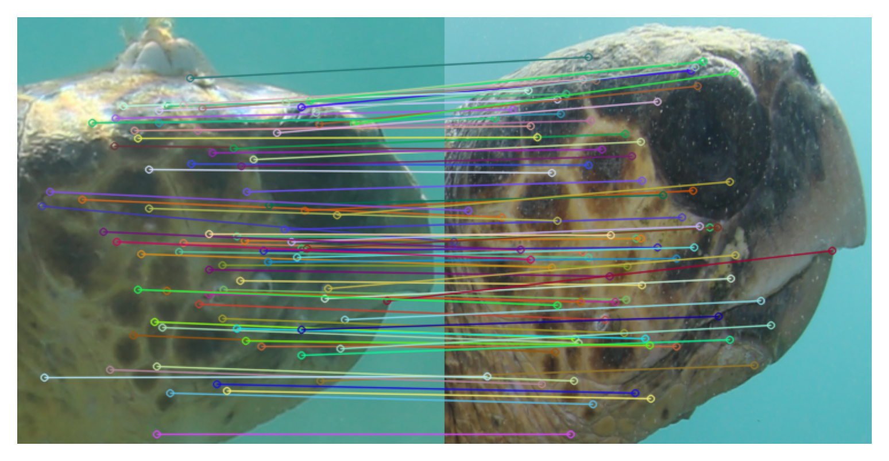
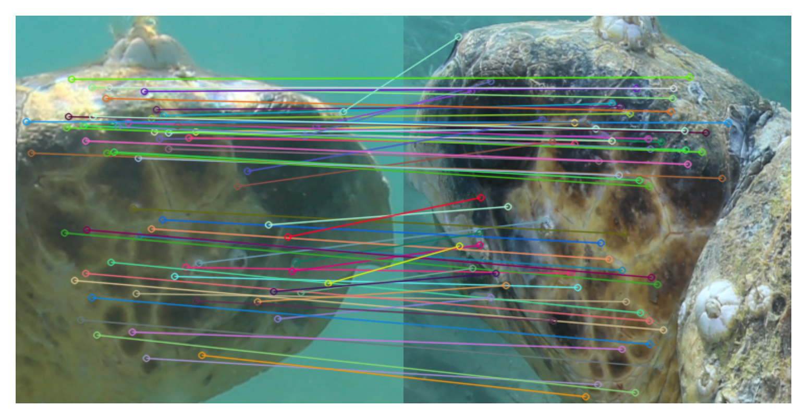

# Similarity of opposite sea turtle profiles

This repository generates results for our paper [Exploiting facial side similarities to improve AI-driven sea turtle photo-identification systems](https://biorxiv.org/cgi/content/short/2024.09.13.612839). We analyzed three different species (loggerheads, greens and hawksbills) with the uniform conclusion is that there is a significant similarity between opposite profile in all three species. The current common practice among biologist is to identify sea turtles based on the same profiles.



Our results imply that it is possible to do so even for opposite profiles



The main conclusion of the paper is that, when trying to match a photo of sea turtle of a given profile, researchers should use photos of both sea turtle profiles (both left and right) as a search database and not only photos of the same profile as it have been done so far.

## Installation

To install the repository, download it first. This can be either done manually or when git is installed by
```script
git clone https://github.com/sadda/sides-matching.git
cd sides-matching
```

Optionally create a virtual environement. To install the required packages, open the console and run

```script
pip install -r requirements.txt
```

## Usage

The code is divided into the notebooks:

- The [first notebook](notebooks/compute_features.ipynb) downloads the three datasets and extracts features from all images.
- The [second notebook](notebooks/matching.ipynb) uses the extracted features to compute similarities between images. Based on these similarities, it predicts which individual turtles are depicted in images. This predictions are then use to conclude that there is a significant similarity between the left and right profiles of individual turtles.
